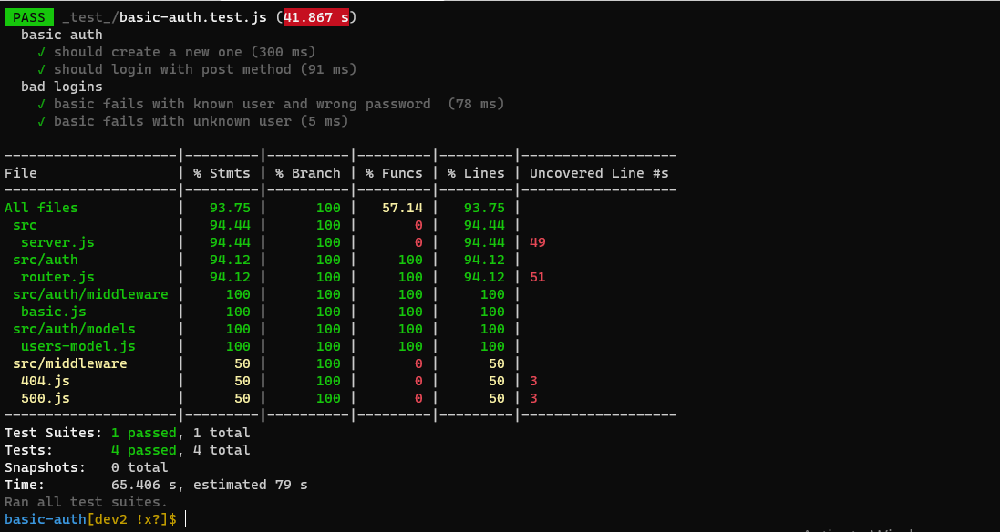
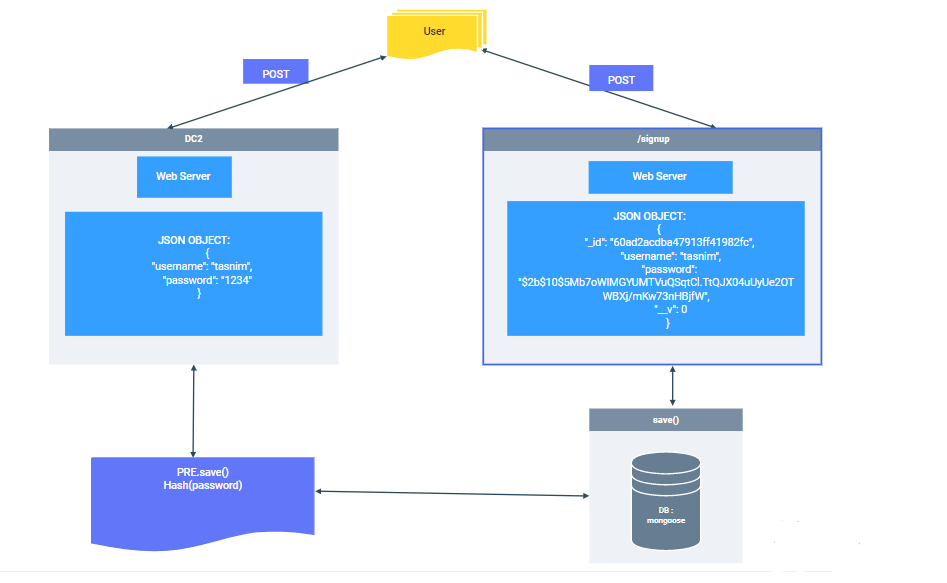

# basic-auth
## LAB - 06
## **Deployment Test**
## **Author: Tasnim Wheebi**
[PR LINK]()

[Heroku APP]()

[Report Test]()

## **Setup**
* .env requirements
  * PORT - 3000
  * MONGOOSE_URI=mongodb://tasnimwheebi:***************

## **Running the app**

###   Dependencies: 
    "@code-fellows/supergoose": "^1.1.0",
    "base-64": "^1.0.0",
    "bcrypt": "^5.0.1",
    "cors": "^2.8.5",
    "dotenv": "^10.0.0",
    "express": "^4.17.1",
    "jest": "^26.6.3",
    "mongoose": "^5.12.10"
  

* Endpoint: 

**npm start**

**nodemon**

 * `/signup` : json object
   

          [

          {
            "username": "tasnim",
            "password": "1234"
            }

           ]

* `/signup`  : json object 

            [

                {
                 "_id": "60ad2acdba47913ff41982fc",
                  "username": "tasnim",
                  "password": "$2b$10$5Mb7oWIMGYUMTVuQSqtCl.TtQJX04uUyUe2OTWBXj/mKw73nHBjfW",
                  "__v": 0
                }

           ]  

  * `/`
            
        Return Welcome to my web App

  * `/bad` 

          Something went wrong

  * `*`

        Page not found 404

## **Tests**

npm test

* 404 on a bad route
* 404 on a bad method
* The correct status codes and returned data for each REST route
  * Test the creation of new user using POST .
  * Test the signup route to login as a user.
  * Test the record user . 

## **UML Diagram**

